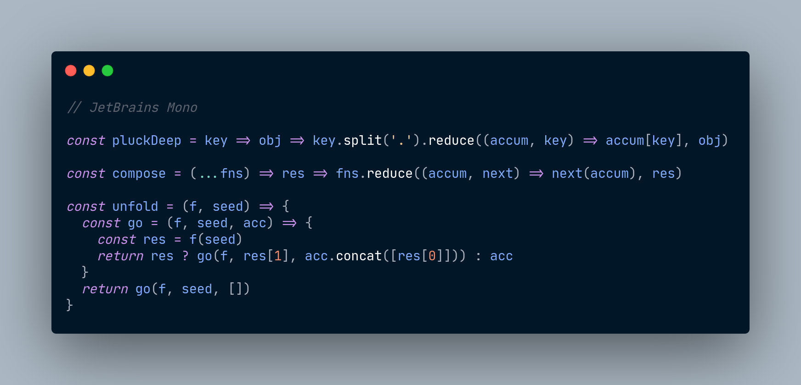
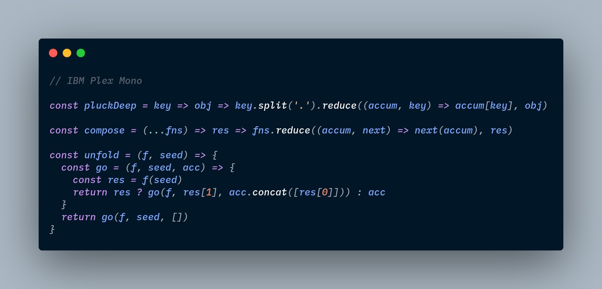
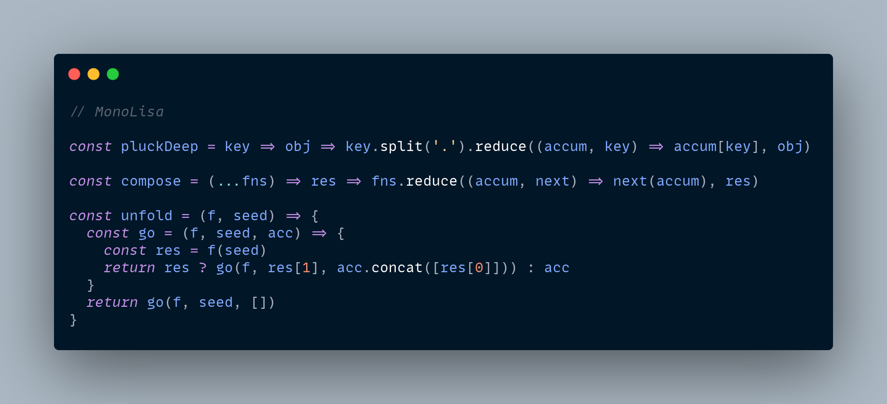

# Typefaces

## __Comparison__

| Typeface      | Mono | Ligature | Open Source | Free |
| ------------- | :--: | :------: | :---------: | :--: |
| JeBrains Mono |  ✓   |    ✓     |      ✓      |  ✓   |
| IBM Plex Mono |  ✓   |    ✗     |      ✓      |  ✓   |
| MonoLisa      |  ✓   |    ✓     |      ✗      |  ✗   |
| Hack          |  ✓   |    ✗     |      ✓      |  ✓   |

If you like using the ligature feature but hasn't been supported by the font yet, maybe you can find the patched version on [NERD FONTS](https://www.nerdfonts.com/).

 

## __Examples__

### **JetBrains Mono**

_A typeface for developers._

[website](https://www.jetbrains.com/) &nbsp; &nbsp;[github](https://github.com/JetBrains/JetBrainsMono)

 

### **IBM Plex Mono**

_A free and open source font for developers, from IBM._

[website](https://www.ibm.com/plex/) &nbsp; &nbsp;[github](https://github.com/IBM/plex)

 

### **MonoLisa**

_A font family designed for software developers. Font follows function._

[website](https://monolisa.dev/)

 

### **Hack**

_Hack is designed to be a workhorse typeface for source code._

[github](https://github.com/source-foundry/Hack)

 

There're lots of fonts for different coding experiences. These 4 are just my personal favorites. You can try different fonts out in [here](https://www.programmingfonts.org/) and find those fonts suit you the most.
---
